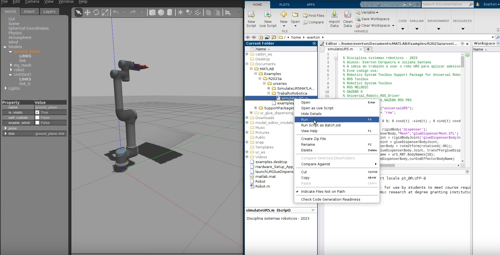
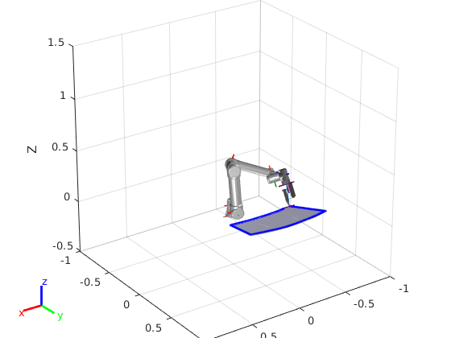
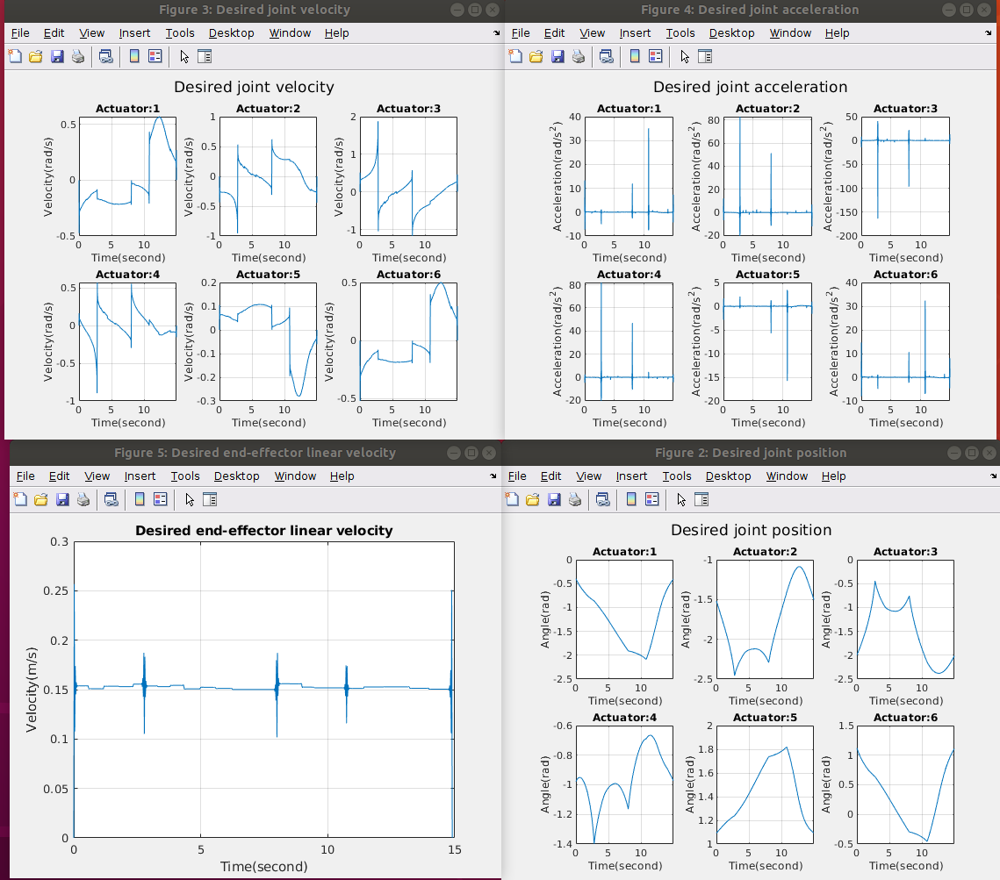

# UR5-simulation-UFBA

## Overview
This example shows how to design real-life application workflows for the UR5 robotic manipulator using Matlab and Gazebo. 

This example uses:

Robotics System Toolbox Support Package for Kinova Gen3 Manipulators (https://www.mathworks.com/help/supportpkg/robotmanipulator/index.html)

ROS Toolbox (https://www.mathworks.com/help/ros/index.html)

Robotics System Toolbox (https://www.mathworks.com/help/robotics/index.html)

ROS Melodic (http://wiki.ros.org/melodic/Installation/Ubuntu)

Gazebo 9 (https://classic.gazebosim.org/tutorials?cat=install&tut=install_ubuntu&ver=9.0)

## Installation


### Install ROS Packages and Dependencies for ROS:

1) Create a new workspace with src folder. This command will make a new catkin folder ur_ws inside the home directory.
   
```
  mkdir -p ~/ur_ws/src
  cd ~/ur_ws
```
  
2) Install git by executing the following command:
```
sudo apt install git -y
```
3) Download the ROS driver packages by executing the following command in the Linux terminal.
```
  git clone https://github.com/UniversalRobots/Universal_Robots_ROS_Driver.git src/Universal_Robots_ROS_Driver
```
4) Download the Gazebo simulation-related packages by executing the following command in the Linux terminal.
```
  git clone -b calibration_devel https://github.com/fmauch/universal_robot.git src/fmauch_universal_robot
```
5) Install dependencies from the custom ROS packages by executing the following commands in the Linux terminal.
```
  sudo apt update -qq
  rosdep update
  rosdep install --from-paths src --ignore-src -y 
```

6) Build the workspace using catkin tool. This will take a few minutes to complete.
```
  catkin_make
```
### Install ur_glue_dispensing_gazebo package

1) Copy  to ur_ws/src
2) Unzip the folder
3) Open the terminal and type:
   ```
   cd ur_ws
   source devel/setup.bash
   catkin_make --only-pkg-with-deps ur_glue_dispensing_gazebo
   source devel/setup.bash
   ```
 ## Running
   1) Clone this repository
   2) In your workspace, include your local folder in the Matlab path
   3) Run the [simulateUR5.m](simulateUR5.m) file
 
### Workspace overview: 



This example can be seen here: https://youtu.be/7HZ0FFU4_uo

### An interactive view of the Robot in Matlab:



### Robot joint information:




      
   
